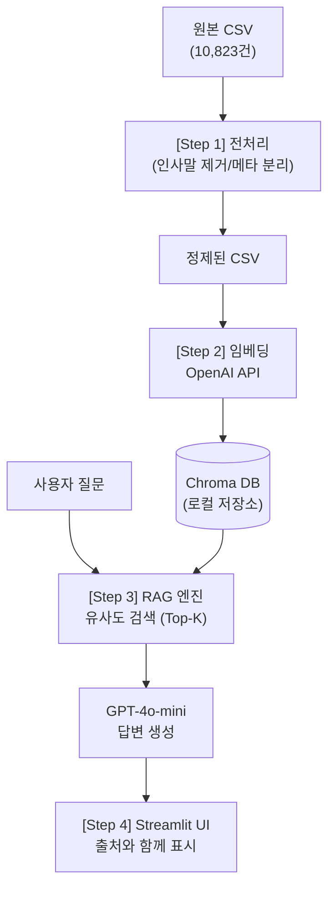

# BK21 FOUR Q&A 챗봇 구현 계획 (최종 확정본)

BK21 FOUR 사업 Q&A 게시판에서 수집한 10,823건의 질문-답변 데이터를 바탕으로, 사용자가 자연어로 질문하면 기존 Q&A를 검색해 답변을 생성하는 **RAG(Retrieval-Augmented Generation) 챗봇**을 구축합니다.

---

## 🎯 확정된 기술 스택 및 정책

| 항목 | 선택된 기술 / 정책 | 비고 |
|------|----------------|------|
| **언어 모델 (LLM)** | OpenAI `gpt-4o-mini` | 빠르고 경제적이며 한국어 포맷팅 우수 |
| **임베딩 모델** | OpenAI `text-embedding-3-small` | 1536차원, 전체 DB 구축 비용 약 130원(₩) |
| **벡터 데이터베이스** | `ChromaDB` (로컬) | 설치가 간편하고 파일 기반 영구 저장 지원 |
| **웹 UI 프레임워크** | `Streamlit` | 파이썬만으로 깔끔한 챗봇 인터페이스 구성 가능 |
| **실행 환경** | Python `venv` 가상 환경 | 패키지 충돌 방지 및 종속성 분리 (완료됨) |

---

## 🛠️ 주요 변경 및 전처리 규칙 (데이터 정제)

데이터 분석 결과 식별된 노이즈를 제거하여 임베딩 및 검색 품질을 높입니다.

1. **미답변 제거**: "답변이 등록되지 않았습니다"가 포함된 데이터 제거
2. **메타데이터 분리 (답변일)**:
   - 답변 텍스트 상단에 붙는 패턴(`BKS관리자\n2026-04-27 16:22:55`)에서 정규표현식을 사용해 **날짜만 추출**하여 `Answer_Date` 컬럼으로 분리합니다.
3. **인사말(노이즈) 제거**:
   - 질문과 답변에 반복적으로 등장하는 "안녕하세요", "BK21사업팀입니다", "감사합니다", "문의드립니다" 등의 텍스트를 제거하여 질문의 본질적인 내용만 남깁니다.
4. **결합 텍스트(Combined_Text)**:
   - 검색 성능을 위해 정제된 Question과 Answer를 묶어 하나의 문서 블록으로 만듭니다.

---

## 🏗️ 시스템 아키텍처 및 파이프라인



---

## 📁 파일 구조 및 구현 단계

총 4개의 파이썬 스크립트로 모듈화하여 구현합니다.

### 1. `preprocess_data.py` (전처리 모듈)
- 원본 `bk21_qna_dataset.csv`를 읽어옵니다.
- 인사말 제거 및 날짜 추출을 수행합니다.
- `bk21_qna_cleaned.csv`로 저장합니다.

### 2. `build_vectordb.py` (벡터 DB 구축 모듈)
- `bk21_qna_cleaned.csv`를 읽어옵니다.
- OpenAI 임베딩을 사용해 텍스트를 벡터화합니다. (100건씩 배치 처리)
- `./chroma_db` 폴더에 데이터를 영구 저장합니다.

### 3. `rag_engine.py` (RAG 코어 엔진)
- ChromaDB에서 사용자의 질문과 가장 유사한 Q&A Top 5개를 검색합니다.
- 검색된 원본 Q&A(Context)와 사용자 질문을 조합해 시스템 프롬프트를 만듭니다.
- `gpt-4o-mini` API를 호출하여 답변을 받습니다.

### 4. `app.py` (웹 애플리케이션)
- Streamlit을 이용해 브라우저에서 동작하는 채팅창을 띄웁니다.
- 대화 기록을 세션에 유지합니다.
- 챗봇의 응답 하단에 참고한 원본 글 번호(nttId)와 날짜를 Expandable UI로 보여줍니다.

---

## 📝 환경 변수 설정
코드가 실행되려면 작업 폴더 루트에 `.env` 파일이 필요합니다.

```env
OPENAI_API_KEY=sk-본인의-실제-오픈AI-키
CHROMA_DB_DIR=./chroma_db
```

## User Review Required

> [!IMPORTANT]
> **API 키 확인**: 코드를 본격적으로 실행하기 전에 프로젝트 폴더 내에 `.env` 파일을 만들고 `OPENAI_API_KEY` 값을 넣어두셨는지 확인 부탁드립니다.

준비되셨다면 승인해 주세요. 
1. 전처리 스크립트 실행
2. 벡터 DB 구축 스크립트 작성 및 실행
순서로 바로 진행하겠습니다!
